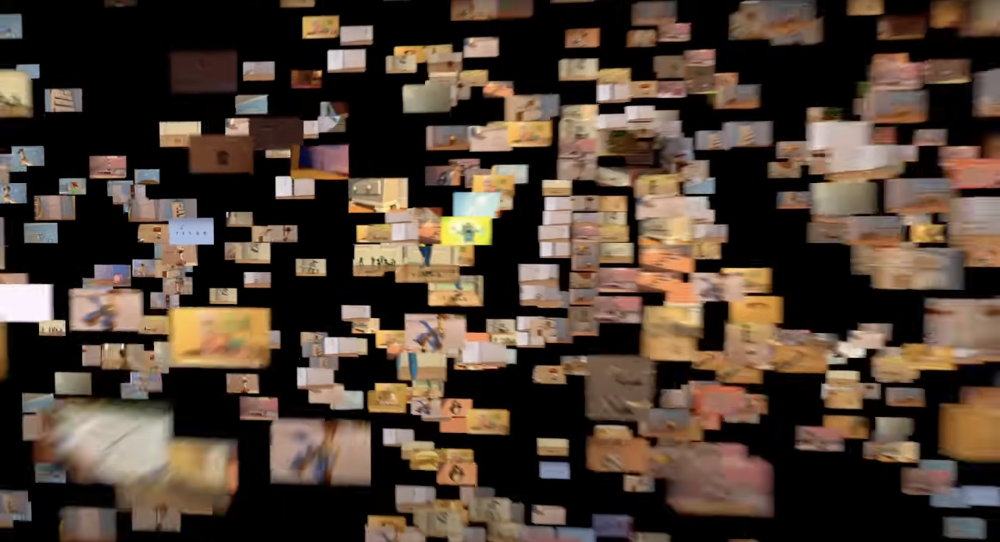
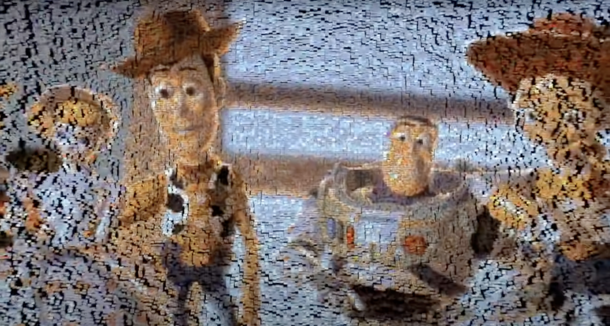

# miqi0604_9103_tut8

# Week8Quiz
## *Part 1: Imaging Technique Inspiration*

I'm going to choose 'Broadway Boogie Woogie',Piet Mondrian as my final project.

As this picture is made by rectangles of 3 colors, so I'm going to make different rectangles show piece by piece like this.

This animation may make the simple rectangles more interesting.

## *Part 2: Coding Technique Exploration*

I may use for loop to set the aim position of each rectangle. 
If the rectangle doesn't arrive at its destination it will keep going.
And if the rectangle arrives the right coordinate it will stop.
So many rectangles will come from different places and combine to be the final picture.

### Links
  [Mosaic Moving](https://www.youtube.com/watch?v=D86vW9Kwp3g)