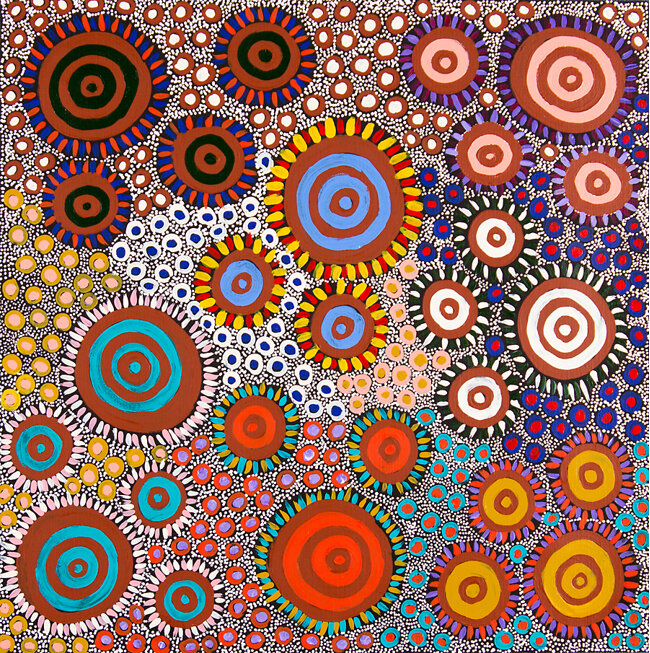
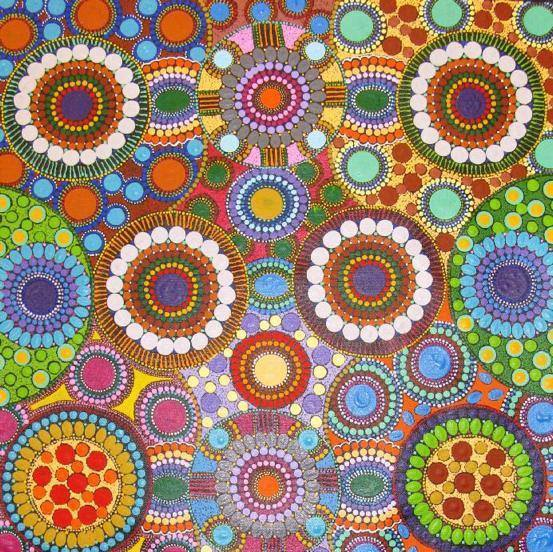
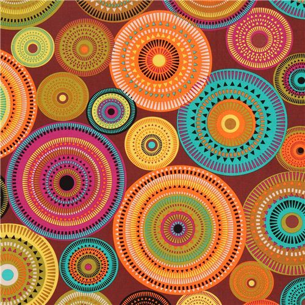

# Final project
## *Stella Qi miqi0604*
 - ## Interaction

  1. Press the spacebar to change simple circles to dots.
  2. Press "1/2/3/4" to rotate or stop each circle.
  3. Press the left mouse button to make the little circles on the background move randomly.

- ## Inspiration

  1. According to these pictures, I changed the circles to dots.
  2. I made the circles rotate because they all look like vortices.
  3. I made the circles on the background move because the background seems complex, full, and beautiful.

- ## Technical explaination

1. I wrote a set of code to change the appearance to dots when pressing the spacebar.
2. I added some variables to check whether users have pressed specific buttons.